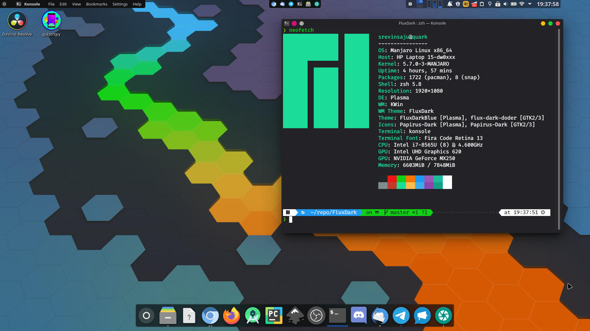
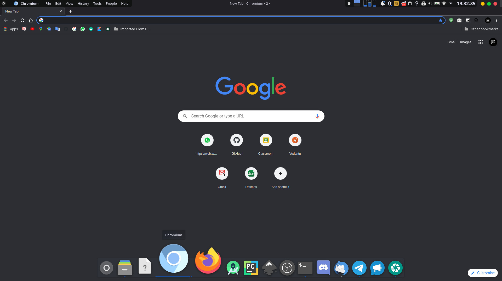

# Flux

> **:warning: This repository is no longer maintained, and contains visual glitches, feel free to fork and work on it if you like**


-----------






## Installation
Install all themes with one command

```bash
make install
```

## Install KDE Theme
Installation of KDE Theme is easy

```bash

cd flux
chmod +x install.sh
./install.sh

```

## Installing GTK theme

```bash

cd flux-gtk
chmod +x install.sh
./install.sh

```
## About
Flux theme is a modded combination of 
[Pear Dark](https://store.kde.org/p/1313728/), 
[Layan Dark Theme](https://github.com/vinceliuice/Layan-gtk-theme) and 
[Vimix GTK](https://github.com/vinceliuice/vimix-gtk-themes)


(c) 
Srevin Saju <[srevinsaju](https://github.com/srevinsaju)>, 
Vince <[vinceliuice](https://github.com/vinceliuice)> (creator of Vimix and Layan) and 
Adhe <[adhec](https://github.com/adhec)> (creator of PearDark Theme)


